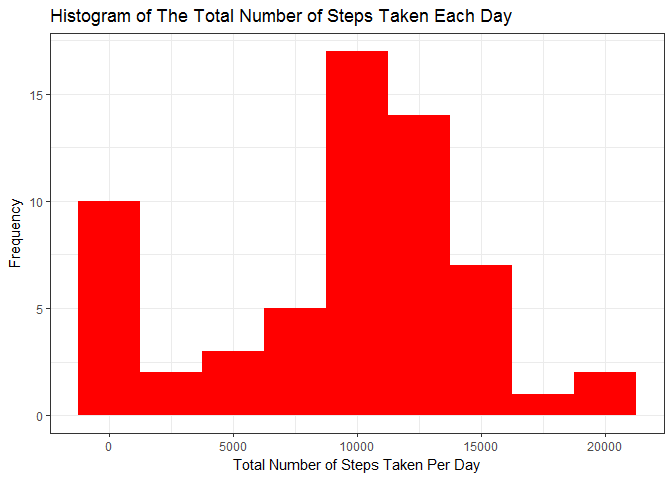
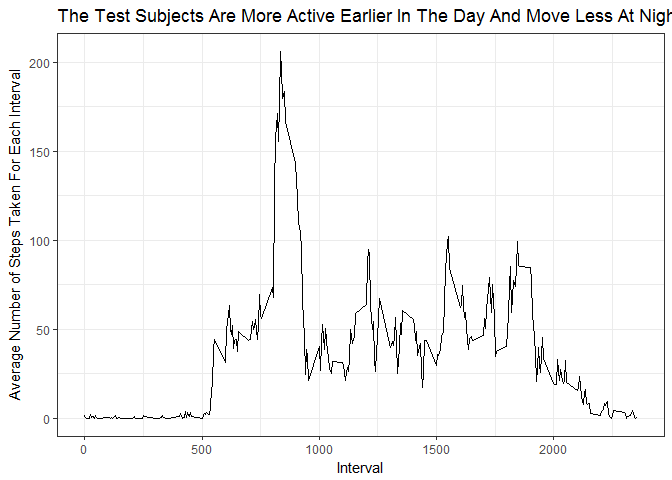
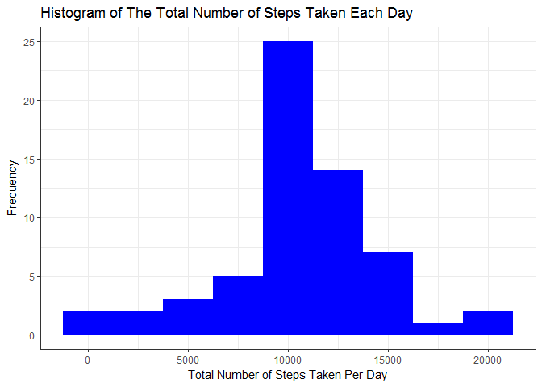
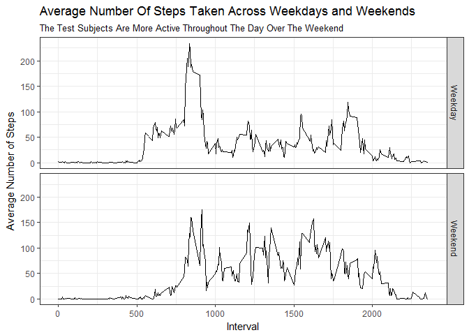

# Reproducible Research: Peer Assessment 1


```r
library(tidyverse)
```

```
## Loading tidyverse: ggplot2
## Loading tidyverse: tibble
## Loading tidyverse: tidyr
## Loading tidyverse: readr
## Loading tidyverse: purrr
## Loading tidyverse: dplyr
```

```
## Conflicts with tidy packages ----------------------------------------------
```

```
## filter(): dplyr, stats
## lag():    dplyr, stats
```

```r
library(lubridate)
```

```
## 
## Attaching package: 'lubridate'
```

```
## The following object is masked from 'package:base':
## 
##     date
```


## Loading and preprocessing the data


```r
fileurl <- "https://d396qusza40orc.cloudfront.net/repdata%2Fdata%2Factivity.zip"

download.file(fileurl, destfile = "activity.zip")

unzip("activity.zip")

data <- read.csv("activity.csv")
```
***

## What is mean total number of steps taken per day?

### Calculate the total number of steps taken per day

```r
data_date <- data %>% 
    mutate(date = ymd(date)) %>% # convert column 'date' to date using lubridate
    group_by(date) %>%
    summarise(total_steps = sum(steps, na.rm = TRUE))
```

```
## Warning: package 'bindrcpp' was built under R version 3.4.1
```

```r
data_date %>% print()
```

```
## # A tibble: 61 x 2
##          date total_steps
##        <date>       <int>
##  1 2012-10-01           0
##  2 2012-10-02         126
##  3 2012-10-03       11352
##  4 2012-10-04       12116
##  5 2012-10-05       13294
##  6 2012-10-06       15420
##  7 2012-10-07       11015
##  8 2012-10-08           0
##  9 2012-10-09       12811
## 10 2012-10-10        9900
## # ... with 51 more rows
```

### If you do not understand the difference between a histogram and a barplot, research the difference between them. Make a histogram of the total number of steps taken each day


```r
# Create a histogram of the total number of steps taken each day
data_date %>% 
    ggplot(aes(total_steps)) +
    geom_histogram(binwidth = 2500, fill = "red") +
    labs(title = "Histogram of The Total Number of Steps Taken Each Day",
         x = "Total Number of Steps Taken Per Day",
         y = "Frequency"
         ) +
    theme_bw()
```

<!-- -->

### Calculate and report the mean and median of the total number of steps taken per day

mean of the total number of steps taken per day `median(data_date$total_steps, na.rm=TRUE)`


```r
mean(data_date$total_steps, na.rm=TRUE)
```

```
## [1] 9354.23
```

median of the total number of steps taken per day `median(data_date$total_steps, na.rm=TRUE)`


```r
median(data_date$total_steps, na.rm=TRUE)
```

```
## [1] 10395
```

***

## What is the average daily activity pattern?

### Make a time series plot (i.e. type = "l") of the 5-minute interval (x-axis) and the average number of steps taken, averaged across all days (y-axis)


```r
data %>% 
    group_by(interval) %>% 
    summarise(avg_steps = mean(steps, na.rm = TRUE)) %>% 
    ggplot(aes(interval, avg_steps)) +
    geom_line() +
    labs(title = "The Test Subjects Are More Active Earlier In The Day And Move Less At Night",
         x = "Interval",
         y = "Average Number of Steps Taken For Each Interval"
         ) +
    theme_bw()
```

<!-- -->


### Which 5-minute interval, on average across all the days in the dataset, contains the maximum number of steps?

Interval 835 has the maximum number of steps


```r
data %>% 
    group_by(interval) %>% 
    summarise(avg_steps = mean(steps, na.rm = TRUE)) %>% 
    arrange(desc(avg_steps)) %>% 
    filter(row_number() == 1)
```

```
## # A tibble: 1 x 2
##   interval avg_steps
##      <int>     <dbl>
## 1      835  206.1698
```

## Imputing missing values

### Calculate and report the total number of missing values in the dataset (i.e. the total number of rows with NAs)


```r
sum(is.na(data$steps)) 
```

```
## [1] 2304
```

### Create a new dataset that is equal to the original dataset but with the missing data filled in.

I will be filling in the missing values with average of each of the observation's interval. 


```r
# Aggregate the datasets to get to average number of steps taken by interval 

data2 <- data %>% 
    group_by(interval) %>% 
    summarise(steps = mean(steps, na.rm = TRUE))

# Create a new column called "complete steps" where we imputed the missing values with the average interval values.

data$completesteps <- 
    ifelse(is.na(data$steps), 
           data2$steps[match(data$interval,data2$interval)], data$steps)
```


### Make a histogram of the total number of steps taken each day and Calculate and report the mean and median total number of steps taken per day. Do these values differ from the estimates from the first part of the assignment? What is the impact of imputing missing data on the estimates of the total daily number of steps?


```r
data %>% 
    mutate(date = ymd(date)) %>% 
    group_by(date) %>% 
    summarise(total_steps = sum(completesteps, na.rm=TRUE)) %>%
    ggplot(aes(total_steps)) +
    geom_histogram(binwidth = 2500, fill = "blue") +
    labs(title = "Histogram of The Total Number of Steps Taken Each Day",
         x = "Total Number of Steps Taken Per Day",
         y = "Frequency") +
    theme_bw()
```

<!-- -->

### Do these values differ from the estimates from the first part of the assignment? What is the impact of imputing missing data on the estimates of the total daily number of steps?


```r
data_date2 <- data %>% 
    mutate(date = ymd(date)) %>% 
    group_by(date) %>% 
    summarise(total_steps = sum(completesteps, na.rm=TRUE))
 
#mean
mean(data_date2$total_steps, na.rm=TRUE)
```

```
## [1] 10766.19
```
 

```r
#median
median(data_date2$total_steps)
```

```
## [1] 10766.19
```

Yes, imputting the missing data resulted in different mean and median values. The frequency of zero value observations also dropped significantly after we filled in the NA values. 

## Are there differences in activity patterns between weekdays and weekends?


### Create a new factor variable in the dataset with two levels - "weekday" and "weekend" indicating whether a given date is a weekday or weekend day.


```r
# Create a new factor variable to indicate whether a date is "weekday" or "weekend"

data1 <- data %>% 
    mutate(date = ymd(date), # Convert the date variable to 'date' using lubridate
           DayofWeek = weekdays(date),
           DayType = ifelse(DayofWeek %in% c("Saturday", "Sunday"), "Weekend", "Weekday"))
```

### Make a panel plot containing a time series plot


```r
data1 %>% 
    group_by(DayType, interval) %>% 
    summarise(avg_steps = mean(steps, na.rm=TRUE)) %>% 
    ggplot(aes(interval, avg_steps)) +
    geom_line() +
    facet_grid(DayType~.) +
    labs(title = "Average Number Of Steps Taken Across Weekdays and Weekends",
         subtitle = "The Test Subjects Are More Active Throughout The Day Over The Weekend",
         x = "Interval",
         y = "Average Number of Steps"
         ) +
    theme_bw()
```

<!-- -->

